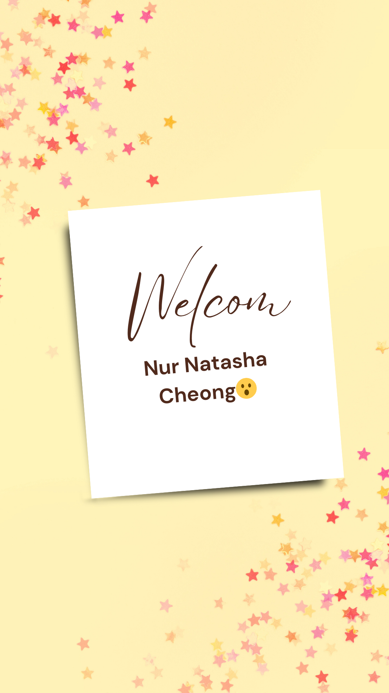
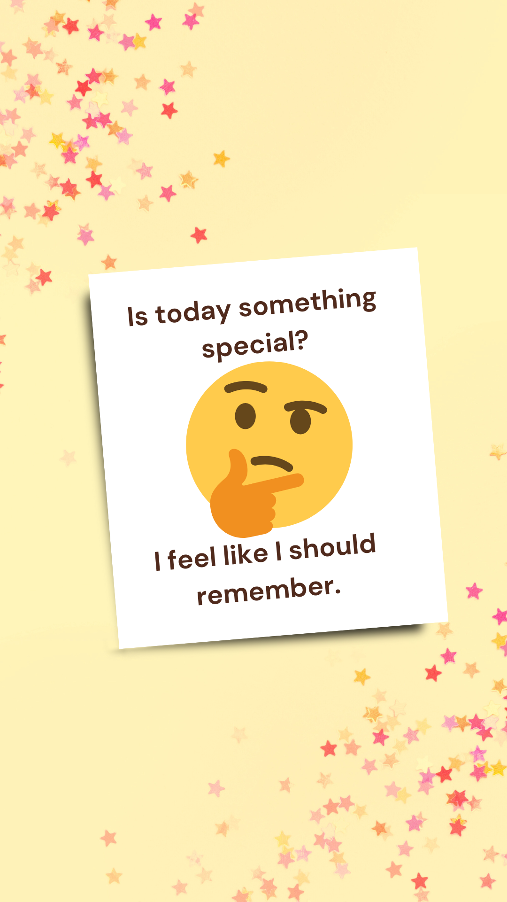
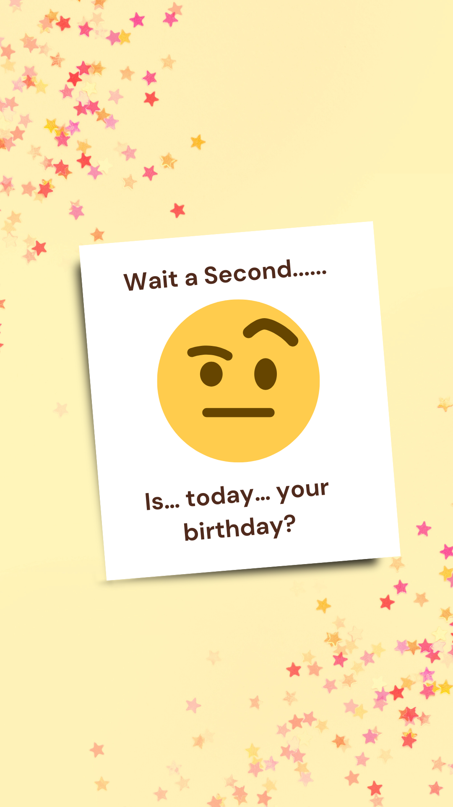

# 🎂 Birthday Wishes App (Jetpack Compose)

A **single‑purpose, emotionally driven Android application** built with **Jetpack Compose + MVVM + Kotlin**.
This project delivers a **5‑frame, story‑like birthday experience** using full‑screen images, auto‑sliding pager, and background music.

---

## ✨ App Preview (All Frames)

> Below are **all 5 frames exactly as used in the app**. These are rendered full-screen via `HorizontalPager`.

<p align="center">
  
  
  
  
  
</p>

---

## 📥 Download APK

<p align="center">
  <a href="https://github.com/mohdazadchaudhary/Birthday-Wishes-App/releases/download/APK/Birthday.Wishes.apk">
    
  </a>
</p>

> Click this button to directly download the APK on your device.

---

## 📱 QR Code for Direct Download

<p align="center">
  
</p>

> Scan this QR code to directly download the APK on your device.

---

## 🧠 Architecture Overview

**Pattern:** MVVM (Model–View–ViewModel)

```
UI (Jetpack Compose)
   ↓ observes
ViewModel (StateFlow)
   ↓ provides data
Repository (Static content)
```

This structure ensures:

* Clean separation of concerns
* Smooth state‑driven UI
* Easy scalability without overengineering

---

## 📁 Current Project Structure

```
com.example.birthdaywishesapp
├── data
│   └── repository
│       └── BirthdayRepository.kt
├── model
│   └── BirthdayPage.kt
├── ui
│   ├── pager
│   │   └── BirthdayPager.kt
│   ├── pages
│   │   └── ImagePage.kt
│   ├── theme
│   └── util
│       └── MusicPlayer.kt
├── viewmodel
│   └── BirthdayViewModel.kt
└── MainActivity.kt

res/
├── drawable
│   ├── page1.png
│   ├── page2.png
│   ├── page3.png
│   ├── page4.png
│   └── page5.png
└── raw
    ├── bg_flow_music.mp3
    └── birthday_celebration.mp3
```

---

## 🎶 Audio Experience

* **Background flow music** for initial pages
* **Celebration music** on the final frame
* Managed using native `MediaPlayer`
* Fully offline, no third‑party dependencies

---

## 🎯 Design Philosophy

* Emotion first, features second
* Minimal UI, maximum feeling
* No unnecessary navigation or clutter

> This app is designed as a **digital birthday letter**, not a utility.

---

## 🚧 Current Status

* ✅ Pager implemented
* ✅ Full‑screen image rendering
* ✅ Auto‑slide logic
* ✅ Background music system
* ⏸ Animations paused (future scope)

---

## 🤍 Note

This repository documents a **learning journey + a personal project**.
It is intentionally kept simple, readable, and honest.

---

**Made with care, intention, and respect for the experience.**
